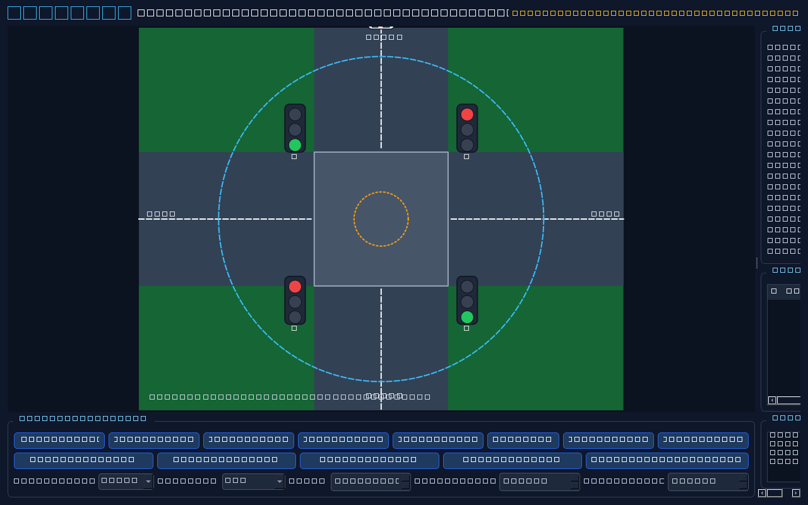

# LifeLane — Smart Ambulance Traffic Signal Preemption Simulator

LifeLane is a Phase 1, software-only demonstration of a four-way traffic junction. It contains a native PySide6 desktop simulator for Raspberry Pi 5 and an Android/Kotlin application that transmits live fused-location telemetry over MQTT.

> **Safety boundary:** LifeLane is a simulator. The included signal timings are synthetic demonstration values and are **not approved for real-road use**. There is no GPIO, relay, cabinet, or physical signal control in this project.



## What is implemented

- Native Qt `QGraphicsScene` four-way junction with four three-lamp heads (12 lamps), lane markings, activation/exit boundaries, and moving ambulance icons.
- Configurable NS/EW normal cycle and an Enum-based preemption FSM with yellow and all-red clearance on entry and recovery.
- A safety invariant checked after every controller transition. A conflict forces all-red `FAIL_SAFE` and requires controlled reset.
- Haversine distance, initial bearings, cardinal approach detection, angular wrap-around, multi-sample movement trends, rolling-median speed, ETA, stale/accuracy/authorization/sequence validation, and multi-sample passage detection.
- Deterministic multi-ambulance queue with medical priority, ETA, waiting time, stable ID tie-break, active-passage protection, and starvation aging.
- Built-in North/South/East/West simulation through the same telemetry pipeline used by MQTT.
- Paho MQTT client with QoS 1, retained junction status, last will, reconnect backoff, environment-based credentials, and lifecycle topics.
- SQLite storage for ambulances, trips, telemetry, and signal events using parameterized statements.
- Rotating application logs in `logs/lifelane.log`.
- Complete Android Studio Compose app with the requested screens, fused GPS, a foreground location service and ongoing notification, 1–2 second telemetry, MQTT reconnect/LWT/QoS 1, ViewModel, StateFlow, and coroutines.

## Raspberry Pi 5 installation

On current 64-bit Raspberry Pi OS Desktop:

```bash
cd /path/to/lifelane
sudo apt update
sudo apt install -y python3-venv python3-pip mosquitto mosquitto-clients libegl1 libgl1 libxcb-cursor0
python3 -m venv .venv
.venv/bin/python -m pip install --upgrade pip
.venv/bin/python -m pip install -r requirements.txt
chmod +x scripts/*.sh
```

The equivalent one-step project script is:

```bash
cd /path/to/lifelane
bash scripts/install_pi.sh
```

Start Mosquitto exactly with:

```bash
sudo systemctl enable --now mosquitto
```

For phone access, install the supplied listener configuration (prototype LAN settings):

```bash
sudo cp config/mosquitto-lifelane.conf /etc/mosquitto/conf.d/lifelane.conf
sudo systemctl restart mosquitto
sudo systemctl status mosquitto --no-pager
```

Run the native simulator from the Raspberry Pi desktop session:

```bash
cd /path/to/lifelane
.venv/bin/python -m raspberry_pi_app.main
```

Do not run the GUI as a system service. Mosquitto is the only background service needed for Phase 1.

Run tests:

```bash
cd /path/to/lifelane
.venv/bin/python -m pytest -q
```

## MQTT configuration

Copy the environment template and edit it without committing credentials:

```bash
cp .env.example .env
nano .env
```

`LIFELANE_MQTT_HOST` defaults to `localhost`; username/password are optional. The included Mosquitto file permits anonymous traffic only to simplify an isolated prototype LAN. For any shared or production network, replace anonymous access with a Mosquitto password file and TLS.

## Connect an Android phone and Raspberry Pi

1. Connect both devices to the same private Wi-Fi network or phone hotspot.
2. On the Pi, find its LAN address with `hostname -I`.
3. Verify the broker with `mosquitto_sub -h localhost -t 'lifelane/#' -v`.
4. If UFW is enabled, allow the private LAN only (adjust the subnet):

   ```bash
   sudo ufw allow from 192.168.0.0/16 to any port 1883 proto tcp
   ```

5. Create `android_app/local.properties` (it is git-ignored):

   ```properties
   sdk.dir=/home/your-user/Android/Sdk
   lifelane.mqtt.host=192.168.1.42
   lifelane.mqtt.port=1883
   lifelane.mqtt.username=
   lifelane.mqtt.password=
   ```

6. Build from Android Studio or the command line:

   ```bash
   cd android_app
   ./gradlew assembleDebug
   ```

7. Install `android_app/app/build/outputs/apk/debug/app-debug.apk`, open LifeLane, grant foreground location/notification permissions, complete the trip setup, and press **Start emergency trip**.
8. In the Pi app, select **Live mobile GPS**. The connection and packet state will appear in the information/event panels.

Android emulator note: use `10.0.2.2` for a broker on the development computer. A physical phone must use the Pi's LAN IP; never use `localhost` for the Pi from the phone.

## Android details

- Minimum SDK: 26
- Compile/target SDK: 36
- Java: 17
- Debug build command: `cd android_app && ./gradlew assembleDebug`
- APK: `android_app/app/build/outputs/apk/debug/app-debug.apk`
- Install with ADB: `adb install -r app/build/outputs/apk/debug/app-debug.apk`

## Project layout

```text
config/                 junction and broker configuration
docs/                   architecture, MQTT protocol, and test guide
raspberry_pi_app/core/  models, GPS, ETA, queue, passage, FSM, invariant
raspberry_pi_app/ui/    native PySide6 widgets and graphics items
raspberry_pi_app/communication/  MQTT topics, validation, and client
raspberry_pi_app/database/       SQLite schema and repository
raspberry_pi_app/simulator/      cardinal synthetic paths
android_app/            complete Gradle/Compose Android application
tests/                  unit and integration tests
scripts/                Raspberry Pi setup and launcher scripts
```

## Troubleshooting

- **Phone cannot connect:** confirm both devices are on the same non-client-isolated network, use the Pi's LAN IP, verify `sudo ss -ltnp | grep 1883`, and check the firewall rule.
- **Mosquitto only accepts localhost:** install `config/mosquitto-lifelane.conf`, restart the service, and inspect `journalctl -u mosquitto -n 100`.
- **Qt cannot initialize a platform plugin:** run in the Raspberry Pi desktop session, not an SSH-only shell. Install the listed EGL/GL/XCB packages. For CI only, set `QT_QPA_PLATFORM=offscreen`.
- **No GPS packets:** grant precise location, confirm the ongoing notification, and disable battery optimization for the test session if the handset vendor throttles foreground services.
- **Packets rejected as stale:** synchronize phone and Pi clocks (`timedatectl status`) and confirm the configured five-second age limit.
- **FAIL_SAFE displayed:** inspect the critical event, correct the cause, then use **Reset simulator** for a controlled all-red restart.
- **Android build SDK error:** install Android SDK Platform 36 and Build Tools 36.x, use JDK 17, and ensure `sdk.dir` is correct.

## Known limitations and next phase

This phase has no hardware I/O, certified controller interface, redundant conflict monitor, cabinet feedback, real authentication provider, encrypted broker provisioning, hospital integration, route/multi-junction orchestration, or regulatory approval. Driver login is a local prototype identity step; authorization is enforced by the junction's configured ambulance ID allow-list. Before physical deployment, use a certified traffic controller interface, electrical isolation, watchdog/conflict monitoring, fail-safe cabinet integration, authenticated mutual TLS, secure key provisioning, field-tested map matching, signed configuration, audited timing plans, and approval by the responsible road authority.

See [architecture](docs/architecture.md), [MQTT protocol](docs/mqtt-protocol.md), and [testing guide](docs/testing-guide.md).
