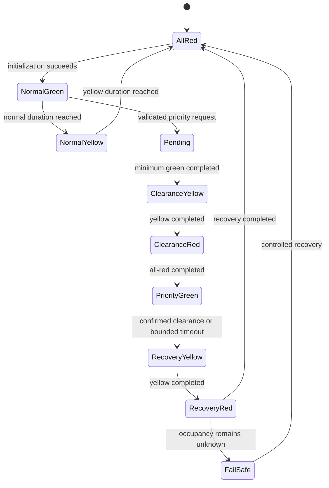

# State machines and approach detection

## Traffic controller

The existing `SignalController` is retained. The Qt simulator and headless GPIO
runtime use this same controller. Signal durations come from `config/junction.yaml`.
Default normal phases are N green/yellow/all-red, E green/yellow/all-red, S
green/yellow/all-red, W green/yellow/all-red. Defaults are 10 s normal green,
4 s minimum green, 3 s yellow, 2 s all-red and 60 s maximum ambulance green.

This diagram omits internal validation/monitoring states but does not permit a
green-to-green transition. A new conflicting request cannot replace the selected
vehicle. An entered vehicle defers cancellation. If its occupancy is still unknown
at maximum green, recovery yellow is followed by a latched all-red fault.

GPIO receives a complete four-approach state. It validates colours and conflicts,
disables permissive outputs, applies the desired state, verifies pin logic and only
then makes an acknowledgement available. Faults latch. Normal startup waits for
initialization; no ACK is inferred from a requested output.

## Canonical ambulance state

`shared/protocol.json` defines all 17 requested canonical states. The Python
coordinator projects validated GPS, queue, passage and controller evidence through
`junction_state(trip_id)`. Android consumes the authenticated canonical state.
`APPROACH_CANCELLED` is an event ending in `CANCELLED`, not a conflicting eighteenth
terminal state. Internal controller phase enums remain separate from vehicle passage.

Confirmed progress is never generated solely by a UI timer. An elapsed phase timer
controls yellow/all-red durations and maximum-green recovery; repeated validated
location events control vehicle entry and clearance.

## Approach and distance

North means north of the junction travelling south; East means east travelling west;
South means south travelling north; West means west travelling east. Approach side
is distinct from movement heading. Python and Kotlin share generated approach names.

The lab configuration supplies inbound paths, polygon, stop progress, exit progress,
bearings and supported movements in local metres. `project_polyline` selects the
closest segment and returns lateral error, cumulative progress and segment heading.
Signed stop distance = stop progress − vehicle progress. It is positive before the
line and negative after it. Driver distance is route progress; centre radius remains
a diagnostic and coverage check. Android uses measured OSRM route progress, not its
old midpoint/straight-line drawing, and checks that the route continues through the
supported outbound road.

The GPS engine retains eight samples per ambulance/trip and a circular heading
window. It rejects stale, reversed-time, reversed-sequence, inaccurate, non-finite,
unrealistic-speed, impossible-jump and off-corridor samples. A stationary heading
does not confirm approach. Gaps reset confirmation; candidate-side changes reset
consecutive counts. At least three consecutive approaching comparisons and a score
of 80 are required. Score weights: corridor 25, heading/movement 25, decreasing
distance 20, accurate fix 15, stable movement history 15.

Entry requires a previous positive signed distance plus at least two reliable
inside-polygon negative-distance samples with matching inbound heading. Clearance
requires confirmed entry, an outside-polygon outbound position, increasing distance,
matching travel heading and three samples at least 80 m after the configured exit.
Missing evidence leaves the state unconfirmed and the bounded safety timeout active.
The current supplied movements are straight; arbitrary turning paths require the
remaining route/passage integration listed in the upgrade guide.

## Vehicle simulation

`TrafficEngine` uses metres, seconds, front-bumper progress, acceleration, speed,
braking distance, vehicle length and following gap. Physics substeps are at most
25 ms regardless of UI speed. Lane leaders limit follower motion; occupied spawn
points reject additional spawns. Red stops the front bumper before the stop line.
Yellow allows commitment only when stopping exceeds the configured braking distance.
Rear-bumper exit determines removal.

Stages are SPAWNED, APPROACHING, QUEUED, STOPPED_AT_RED, MOVING_ON_GREEN,
CROSSING_STOP_LINE, INSIDE_JUNCTION, EXITING, CLEARED and REMOVED. QUEUED and
STOPPED_AT_RED are conditional stages: a vehicle arriving on unobstructed green
does not invent a stop. Vehicles move continuously; the Qt scene renders progress.
Desktop ambulances advance on the same delta-time loop and respect ordinary-vehicle
leaders and red lamps. Other vehicles treat ambulances as lane obstacles.

Generated/cleared counts, queue sizes, cumulative waiting, average/max waiting,
average speed and throughput are calculated from vehicle state and elapsed simulation
time. No randomly generated metric values are used. Hardware-monitor mode freezes
simulation when the actual controller heartbeat expires and preserves last-known
lamp presentation with an explicit warning.
